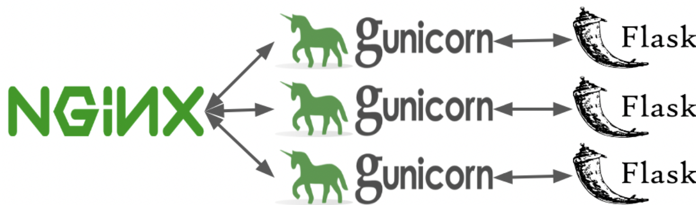

# Weather Map

Website that reads current weather data from NOAA, creates a folium map and pushes this to the user.

This is a prototype and proof of concept.  In particular we are evaluation methods and research for programmatic map making without a gis.  The goal is to evaluate resource requirements and constraints.

This implementation is run on AWS Lightsail using nginx, gunicorn and flask.  The architecture, pictured below,  is discussed this link  and evolved from several tutorials as stated below.

https://medium.com/@maheshkkumar/a-guide-to-deploying-machine-deep-learning-model-s-in-production-e497fd4b734a




*Nginx is a load balancer and reverse proxity.  It is used as an end point for web traffic and routes incoming http requests.

*Gunicorn creates multiple forks which are called workers to handle the requests

*Flask is a micro web framework written in Python that handles http requests: GET, POST, etc.


## Working template for nginx/gunicorn/flask on aws lightsail.

### This work is adapted from:

https://towardsdatascience.com/how-to-deploy-ml-models-using-flask-gunicorn-nginx-docker-9b32055b3d0

and was deployed to ligntsail ec2 here:

Instructions are below:


### map implementation 
This will run from ec2 because docker images have to be uploaded to lightsail to create a deployment.  Docker images created on M1 processors fail on Lightsail containers.

1.  create an ubuntu ec2 instance (on lightsail)
  on lightsail create a static ip address - xx.xx.xxx.xxx.
2.  ssh to this instance from you local machine
```
ssh -i <your key> ubuntu@xx.xx.xxx.xxx
```

 install docker via docker-compose on the ec2 instance

```
sudo apt update

sudo apt upgrade

sudo apt install docker-compose

```

3.  install aws cli

https://docs.aws.amazon.com/cli/latest/userguide/getting-started-install.html

```
curl "https://awscli.amazonaws.com/awscli-exe-linux-x86_64.zip" -o "awscliv2.zip"

sudo apt install unzip

sudo ./aws/install

```

configure aws:
https://docs.aws.amazon.com/cli/latest/userguide/getting-started-quickstart.html
the parameter for the configure are given to you.

```
sudo aws configure

```

note:  it has to be sudo

AWS Access Key ID [None]: your id
AWS Secret Access Key [None]: your access key
Default region name [None]: us-west-2
Default output format [None]: json

4.  Install aws lightsail thing:

https://lightsail.aws.amazon.com/ls/docs/en_us/articles/amazon-lightsail-install-software

```

sudo curl "https://s3.us-west-2.amazonaws.com/lightsailctl/latest/linux-amd64/lightsailctl" -o "/usr/local/bin/lightsailctl"

sudo chmod +x /usr/local/bin/lightsailctl


```

5.  Clone this repository on the ec2 instance:

```
git clone https://github.com/marilynwaldman/lightsail-weather-map.git
cd lightsail-weather-map

```

6.  cd to nginx and change the project.conf server to localhost.  It is flask_app when running from docker-compose on ec2.


7.  The map server will run on a separate lightsail container.  Delete an existing container if it exists.  Log into your lightsail console to see if a service is running

```
sudo aws lightsail delete-container-service --service-name weather-service
```

Wait for the completion of this task before continuting.

8.  Build the docker images of the flask app and nginx on the ec2 instance.

cd to the repo and run the docker build commands.  These steps are formally discussed below.

```
cd  lightsail-map-server
sudo docker build -t flask-container ./flask
sudo docker build -t nginx-container ./nginx


```

9.  Create the static map service on lightsail from the ec2 instance


```
sudo aws lightsail create-container-service --service-name  weather-service \
--power small \
--scale 1
```

Use the get-container-services command to monitor the state of the container as it is being created.  

Also log into the lightsail console and check container services.

```
sudo aws lightsail get-container-services --service-name weather-service
```

10. Push the Flask application container to Lightsail with the push-container-image command.
```
sudo aws lightsail push-container-image --service-name weather-service \
--label flask-container \
--image flask-container
```

```
sudo aws lightsail push-container-image --service-name weather-service \
--label nginx-container \
--image nginx-container


```

From the lightsail console get the number of the images uploaded and update the containers.json file:

Either vi the ec2 file or update locally, push to github and pull on ec2.


11.  Deploy the containers:

Deploy the containers to the container service with the AWS CLI using the create-container-service-deployment command.

```
sudo aws lightsail create-container-service-deployment --service-name weather-service \
--containers file://containers.json \
--public-endpoint file://public-endpoint.json

```


### How to Setup an Nginx Reverse Proxy using Amazon Lightsail Containers
In this guide, you'll learn how to configure a Flask web server behind an Nginx reverse proxy using Lightsail containers. The Nginx reverse proxy accepts web requests on port 80 and forwards them to the Flask web server on port 5000. The Flask web server fulfills the requests and return the response to Nginx. A Lightsail container service will be created to host both the Nginx and the Flask containers. A public endpoint will be created to allow external access to the Nginx server. 

To get started, you'll need an [AWS account](https://portal.aws.amazon.com/billing/signup) and must install [Docker](https://docs.docker.com/engine/install/), [Docker compose](https://docs.docker.com/compose/install/), the [AWS Command Line Interface (CLI) tool](https://docs.aws.amazon.com/cli/latest/userguide/cli-chap-install.html) and the [Lightsail Control (lightsailctl) plugin](https://lightsail.aws.amazon.com/ls/docs/en_us/articles/amazon-lightsail-install-software) on your system. Follow the provided links if you don't have some of those.

### 1. Get the source code
1. The source code to accompany this guide can be found in this repository. To get started, clone the GitHub respository locally.

   ```bash
   git clone https://github.com/awsgeek/lightsail-containers-nginx.git
   ```

2. Change to the project directory
   ```bash
   cd lightsail-containers-nginx
   ```

## 2. The Flask application
   The Flask application contains a single ```hello_world()``` function that is triggered when the route ```/``` is requested. When run, this application binds to all IPs on the system ("0.0.0.0") and listens on port 5000 (this is the default Flask port).

   The source for the Flask application, ```app.py```, is shown below.

   ```python
   from flask import Flask
   app = Flask(__name__)

   @app.route("/")
   def hello_world():
      return "Hello, World!"

   if __name__ == "__main__":
      app.run(host="0.0.0.0", port=5000)
   ```

   The Dockerfile for the Flask application uses a Python alpine image to minimize container image size. The command to run when the container starts is the same as if run from the command line: ```python app.py```

   ```
   # Set base image (host OS)
   FROM python:3.8-alpine

   # By default, listen on port 5000
   EXPOSE 5000/tcp

   # Set the working directory in the container
   WORKDIR /app

   # Copy the dependencies file to the working directory
   COPY requirements.txt .

   # Install any dependencies
   RUN pip install -r requirements.txt

   # Copy the content of the local src directory to the working directory
   COPY app.py .

   # Specify the command to run on container start
   CMD ["python", "./app.py"]
   ```

## 3. Build the Flask container

Complete the following steps to build the Flask applicaiton container on your local system.

1. Build the container using Docker. Execute the following command from the project directory:
   ```
   docker build -t flask-container ./flask
   ```
   This command builds a container using the Dockerfile in the current directory and tags the container ```flask-container```.

2. Once the container build is done, test the Flask application locally by running the container:
   ```
   docker run -p 5000:5000 flask-container
   ```
3. The Flask app will run in the container and will be exposed to your local system on port 5000. Browse to http://localhost:5000 or use ```curl``` from the command line and you will see ```Hello, World!```
   
   ```
   curl localhost:5000
   
   Hello, World!
   ```

   To stop the container, type ```CTRL+C```

## 4. The Nginx reverse proxy

   The Nginx reverse proxy forwards all requests to the Flask application on port 5000. Configuring Nginx to forward reqests reuqires a simple configuration file, ```nginx.conf```:

   ```
   events {}

   http {

      upstream flask {
         server ${FLASK_HOST}:${FLASK_PORT};
      }

      # a simple reverse-proxy
      server {

         listen 80 default_server;

         location / {
               # pass requests to the Flask host
               proxy_pass http://flask;
         }
      }
   }
   ```

   This configuration forwards all requests to the upstream Flask server. The hostname and port of the Flask server are provided as environmental variables when the containers are run. 

   The ```Dockerfile``` for the Nginx reverse proxy uses the master Nginx alpine image and simply copies the ```nginx.conf``` configuration file to the appropriate directory.

   ```
   FROM nginx:1.19-alpine
   COPY ./nginx.conf /etc/nginx/templates/nginx.conf.template
   ```
   
## 5. Build the Nginx container

Complete the following steps to build the Nginx reverse proxy container on your local system.

1. Build the container using Docker. Execute the following command from the project directory:
   ```
   docker build -t nginx-container ./nginx
   ```
   This command builds a container using the Dockerfile in the current directory and tags the container ```nginx-container```.

2. After the container build is done, test the Nginx proxy and Flask application locally by running the container:
   ```
   docker-compose up --build
   ```
3. Both the Flask application and Nginx reverse proxy containers will be run. The Nginx server listens for requests on port 80 and forwards them to the Flask application. Browse to http://localhost or use ```curl``` from the command line and you will see ```Hello, World!```.
   
   ```
   curl localhost
   
   Hello, World!
   ```

   To stop the containers, type ```CTRL+C```

## 6. Create a container service

Complete the following steps to create the Lightsail container service and then push your local container images to the new container service.

1. Create a Lightsail container service with the [create-container-service](https://awscli.amazonaws.com/v2/documentation/api/latest/reference/lightsail/create-container-service.html) command.
   
   ```
   aws lightsail create-container-service --service-name sample-service \
   --power small \
   --scale 1
   ```
   The power and scale parameters specify the capacity of the container service. For the purposes of this guide, little capacity is required.

   The output of the create-container-service command indicates the state of the new service is ```PENDING```.
   ```
   {
       "containerService": {
           "containerServiceName": "sample-service",
           ...
           "state": "PENDING",
   ```
   
   Use the [get-container-services](https://awscli.amazonaws.com/v2/documentation/api/latest/reference/lightsail/get-container-services.html) command to monitor the state of the container as it is being created.
   
   ```
   aws lightsail get-container-services --service-name sample-service
   ```
   
   Wait until the container service state changes to ```ACTIVE``` before continuing to the next step. Your container service should become active after a few minutes.

2. Push the Flask application container to Lightsail with the [push-container-image](https://awscli.amazonaws.com/v2/documentation/api/latest/reference/lightsail/push-container-image.html) command.
   ```
   aws lightsail push-container-image --service-name sample-service \
   --label flask-container \
   --image flask-container

   ...

   Refer to this image as ":sample-service.flask-container.X" in deployments.
   ```
   Note: the ```X``` in ```sample-service.flask-container.X``` will be a numeric value. If this is the first time you’ve pushed an image to your container service, this number will be 1. You will need this number in the next step.

3. Push the Nginx reverse proxy container to Lightsail with the [push-container-image](https://awscli.amazonaws.com/v2/documentation/api/latest/reference/lightsail/push-container-image.html) command.
   ```
   aws lightsail push-container-image --service-name sample-service \
   --label nginx-container \
   --image nginx-container

   ...

   Refer to this image as ":sample-service.nginx-container.Y" in deployments.
   ```
   Note: the ```Y``` in ```:sample-service.nginx-container.Y``` will be a numeric value. If this is the first time you’ve pushed an image to your container service, this number will be 1. You will need this number in the next step.

## 7. Deploy the containers

Complete the following steps to create deployment and public endpoint configuration JSON files, and then deploy your container images to your container service.

1. Create a new file, ```containers.json```. Edit the file and add the following. Replace the ```X``` in ```:sample-service.flask-container.X``` and the ```Y``` in ```:sample-service.nginx-container.Y``` with the numeric values from the previous step. Save the file.
   ```
   {
      "sample-nginx": {
         "image": ":sample-service.nginx-container.Y",
         "command": [],
         "ports": {
               "80": "HTTP"
         },
         "environment": {
               "NGINX_ENVSUBST_OUTPUT_DIR": "/etc/nginx",
               "FLASK_HOST": "localhost",
               "FLASK_PORT": "5000"
         }
      },
      "sample-flask": {
         "image": ":sample-service.flask-container.X",
         "ports": {
               "5000": "HTTP"
         }
      }
   }

   ```
   The ```containers.json``` file describes the settings of the containers that will be launched on the container service. In this instance, the containers.json file describes both the Nginx and Flask containers, the images the containers will use and the ports the containers will expose. In addition, environmental variables that specify the Flask host and port are provided. At runtime Nginx will replace the placeholder values in the nginx.conf file with the actual values provided here.

2. Create a new file, ```public-endpoint.json```. Edit the file and add the following. Save the file.
   ```
   {
       "containerName": "sample-nginx",
       "containerPort": 80
   }
   ```
   The ```public-endpoint.json``` file describes the settings of the public endpoint for the container service. In this instance, the public-endpoint.json file indicates the Nginx container will expose port 80. Public endpoint settings are only required for services that require public access.

3. Deploy the containers to the container service with the AWS CLI using the [create-container-service-deployment](https://awscli.amazonaws.com/v2/documentation/api/latest/reference/lightsail/create-container-service-deployment.html) command.

   ```
   aws lightsail create-container-service-deployment --service-name sample-service \
   --containers file://containers.json \
   --public-endpoint file://public-endpoint.json
   ```
   The output of the ```create-container-service-deployment``` command indicates that the state of the container service is now ```DEPLOYING```.
   ```
   {
       "containerServices": [{
           "containerServiceName": "sample-service",
           ...
           "state": "DEPLOYING",
   ```
   Use the [get-container-services](https://awscli.amazonaws.com/v2/documentation/api/latest/reference/lightsail/get-container-services.html) command to monitor the state of the container until it changes to ```RUNNING``` before continuing to the next step.
   
   ```
   aws lightsail get-container-services --service-name sample-service
   ```
   
   The ```get-container-service``` command also returns the endpoint URL for container service.
   
   ```
   {
       "containerServices": [{
           "containerServiceName": "sample-service",
           ...
           "state": "RUNNING",
           ...
           "url": "https://sample-service...
   ```
   After the container service state changes to ```RUNNING```, navigate to this URL in your browser to verify your container service is running properly. Your browser output should show "Hello, World!" as before.

   Congratulations. You have successfully deployed a containerized Nginx reverse proxy and Flask application using Amazon Lightsail containers.

## Cleanup

Complete the following steps to the Lightsail container service that you created as part of this tutorial.

To cleanup and delete Lightsail resources, use the [delete-container-service](https://awscli.amazonaws.com/v2/documentation/api/latest/reference/lightsail/delete-container-service.html) command.
```
aws lightsail delete-container-service --service-name sample-service
```
The ```delete-container-service``` removes the container service, any associated container deployments, and container images.

## Additional Resources
The source code for this guide and this documentation is located in this [GitHub repository](https://github.com/AwsGeek/lightsail-containers-nginxq)


### some notes for updating the weather map

### Some notes ; this stuff for testing locally on ec2 prior to lightsail distribution
```

removing all containers and images
sudo docker rm $(sudo docker ps -a -f status=exited -q)
sudo docker ps -a
sudo docker stop $(sudo docker ps -a -q)
sudo docker rm $(sudo docker ps -a -q)
sudo docker rmi $(sudo docker images -a -q)
docker exec -it 9b3e605f8d54 /bin/sh
sudo docker exec -it 412c97d0a9fb /bin/sh
sudo docker logs 569668ca1756

sudo docker build -t flask-container ./flask

sudo aws lightsail push-container-image --service-name weather-service \
--label flask-container \
--image flask-container


sudo aws lightsail create-container-service-deployment --service-name weather-service \
--containers file://containers.json \
--public-endpoint file://public-endpoint.json


```
